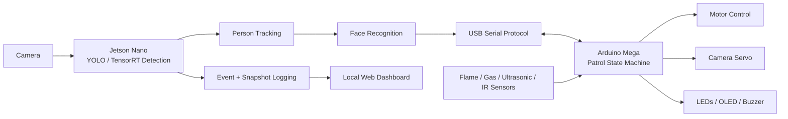

# PatrolPro

**Autonomous safety patrol robot combining edge computer vision with real-time embedded control.**


> **HKU Integrated Design Project — Grade: A+**

PatrolPro is a team-built autonomous patrol robot developed at the University of Hong Kong. The system separates compute-heavy perception from deterministic hardware control: a **Jetson Nano** handles person detection, tracking, face recognition, event capture, and the local monitoring dashboard, while an **Arduino Mega** owns the robot state machine and controls motors, sensors, LEDs, OLED, buzzer, and camera servo.

The architecture is designed around explicit safety priorities: environmental hazards and obstacle handling can stop or override normal patrol behavior, while person verification is coordinated between the Jetson and Arduino over a compact serial protocol.

## Highlights

- **Edge vision:** YOLO/TensorRT-based person detection with persistent multi-person tracking on Jetson Nano.
- **Identity verification:** Face recognition workflow for distinguishing registered users from unknown visitors.
- **Autonomous patrol:** Obstacle-aware movement, speed reduction, stop/reverse/turn behavior, and explicit manual/automatic modes.
- **Hazard response:** Fire and gas sensing with prioritized stop, alarm, LED, OLED, and audio responses.
- **Cross-device coordination:** USB serial messaging between Jetson perception services and the Arduino state machine.
- **Operational visibility:** Snapshot/event logging and a lightweight browser dashboard for live status and review.
- **Fail-safe startup:** The robot boots stopped and begins autonomous patrol only after an explicit `AUTO` command.

## System Architecture



The Jetson acts as the **perception layer**; the Arduino remains the **control authority** for motion and safety-critical outputs. This keeps vision workloads isolated from the embedded control loop and allows the robot to stop or respond to hazards independently of the vision pipeline.

For a deeper breakdown, see [Architecture](docs/ARCHITECTURE.md).

## Runtime Flow

1. The Arduino boots in a safe stopped state.
2. `AUTO` enables autonomous patrol.
3. Ultrasonic and hazard sensors continuously influence movement and safety state.
4. The Jetson detects and tracks people from the camera stream.
5. Stable tracks trigger face verification.
6. Jetson sends compact `STATUS:` messages to the Arduino.
7. The Arduino transitions into verification, verified-user, unknown-person, or hazard states and drives the corresponding physical outputs.
8. Events and snapshots are persisted for later review through the local dashboard.

### Safety Priority

The embedded controller prioritizes safety events over normal patrol behavior. Examples implemented in the current firmware include:

- Slow down when a front obstacle is approximately **20–35 cm** away.
- Stop at approximately **20 cm or less**.
- Reverse briefly before selecting a turn direction when rear space is available.
- Stop and enter alert mode when fire/gas hazards are detected.
- Apply a short **300 ms** heading correction when a detected person is significantly off-center before beginning face verification.

## Core Components

| Component | Responsibility |
| --- | --- |
| `detect_people.py` | Main Jetson runtime: TensorRT person detection, tracking, face-verification orchestration, serial messaging, dashboard updates |
| `face_id.py` | Face detection and recognition pipeline |
| `arduino_link.py` | Jetson ↔ Arduino serial bridge |
| `web_dashboard.py` | Lightweight HTTP dashboard for MJPEG video, snapshots, and event review |
| `snapshot_writer.py` | Snapshot and event persistence |
| `PatrolPro_Phase2/` | Modular Arduino Mega firmware and patrol state machine |
| `SensorSuite.*` | IR, gas, ultrasonic sensing and hazard evaluation |
| `MotorControl.*` | Four-motor movement primitives |
| `StatusOutputs.*` | LEDs, OLED, buzzer, and servo outputs |
| `SerialProtocol.*` | Command parsing and Jetson/Arduino message handling |
| `PatrolController.*` | Patrol, hazard, verification, and intruder state transitions |

## Repository Structure

```text
PatrolPro/
├── PatrolPro_Phase2/          # Current modular Arduino firmware
│   ├── PatrolPro_Phase2.ino
│   ├── PatrolController.*
│   ├── SensorSuite.*
│   ├── MotorControl.*
│   ├── StatusOutputs.*
│   ├── SerialProtocol.*
│   └── Config.h
├── detect_people.py           # Main Jetson computer-vision runtime
├── face_id.py                 # Face recognition
├── arduino_link.py            # Serial bridge
├── web_dashboard.py           # Monitoring dashboard
├── snapshot_writer.py         # Event/snapshot persistence
├── audio_player.py            # Audio alert playback
├── capture_enroll.py          # Face enrollment capture
├── enroll.py                  # Face registration utilities
├── test_face_detect.py        # Vision test utility
├── test_serial.py             # Serial test utility
├── IR_test/                   # Sensor experiments
├── Servo_test/                # Servo experiments
├── hazard_monitor/            # Earlier integrated Arduino prototype
├── wall_bounce/               # Motion-control prototype
├── docs/
│   ├── README.md              # Documentation index
│   ├── ARCHITECTURE.md
│   ├── SERIAL_PROTOCOL.md
│   └── reference/
│       ├── CODEBASE_NOTES.md
│       └── JETSON_NOTES.md
└── README.md
```

## Documentation

- [Documentation index](docs/README.md)
- [System architecture](docs/ARCHITECTURE.md)
- [Jetson ↔ Arduino serial protocol](docs/SERIAL_PROTOCOL.md)
- [Arduino firmware guide](PatrolPro_Phase2/README_Phase2.md)
- [Codebase reference](docs/reference/CODEBASE_NOTES.md)
- [Jetson setup and troubleshooting](docs/reference/JETSON_NOTES.md)

## Quick Start

### 1. Arduino Mega

Upload the active firmware:

```text
PatrolPro_Phase2/PatrolPro_Phase2.ino
```

Open the Serial Monitor at **115200 baud**.

Useful commands:

```text
AUTO       start autonomous patrol
MANUAL     enter manual stopped mode
STOP       immediate stop
F 1000     forward for 1 second
B 500      reverse for 0.5 seconds
L 800      turn left for 0.8 seconds
R 800      turn right for 0.8 seconds
```

See [Serial Protocol](docs/SERIAL_PROTOCOL.md) for the full command/message reference.

### 2. Jetson Nano

The Jetson runtime expects the camera, TensorRT engine, face database, and Arduino serial device to be configured for the target machine.

Key environment-specific values currently live in the Jetson scripts, including:

- TensorRT engine path
- Arduino serial device
- face enrollment/database paths

Run the main runtime with the browser dashboard enabled:

```bash
python3 detect_people.py --web
```

To disable the local OpenCV display:

```bash
python3 detect_people.py --web --no-local-display
```

> TensorRT, PyCUDA, and Jetson camera dependencies are platform-specific and should be installed through the Jetson software environment rather than treated as generic desktop Python dependencies.

## Engineering Decisions

### Split perception from control

The Jetson performs GPU-heavy vision work while the Arduino owns the patrol state machine. The robot can therefore maintain deterministic sensor/output behavior without coupling motor control directly to the computer-vision frame loop.

### Explicit serial contract

Jetson and Arduino communicate through compact messages such as:

```text
STATUS:CLEAR
STATUS:T0:SCANNING:LEFT
STATUS:T0:VERIFIED:Noah,T1:UNKNOWN
FACE_TIMEOUT
HEARTBEAT
```

The Arduino can also send control messages back to the Jetson, including audio playback requests.

### Graceful vision shutdown

The Jetson runtime handles `SIGINT` and `SIGTERM` through a shutdown flag so the main loop can finish the current frame rather than relying on an interrupt during CUDA execution.

## Development References

Detailed working references have been moved out of the repository root so the project landing page stays portfolio-focused:

- [Codebase Notes](docs/reference/CODEBASE_NOTES.md) — active modules, responsibilities, and historical prototypes.
- [Jetson Notes](docs/reference/JETSON_NOTES.md) — platform environment, TensorRT setup, and troubleshooting.
- [Phase 2 Firmware Guide](PatrolPro_Phase2/README_Phase2.md) — Arduino behavior, controls, and hardware-output details.

Prototype directories such as `IR_test/`, `Servo_test/`, `wall_bounce/`, and `hazard_monitor/` are intentionally retained as engineering history rather than presented as active production modules.

## Project Context

PatrolPro was developed as an **HKU Integrated Design Project** in a **5-person team**. The project received an **A+** course grade.

The repository is retained as an engineering portfolio artifact showing embedded control, edge computer vision, hardware/software integration, and iterative system prototyping.
