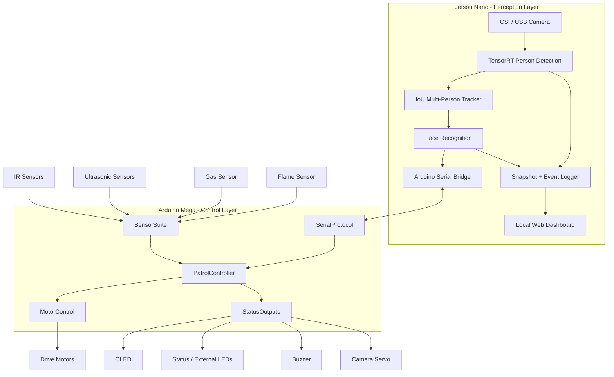
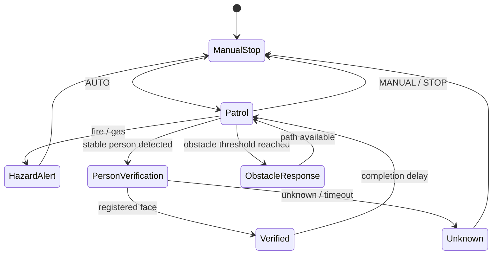
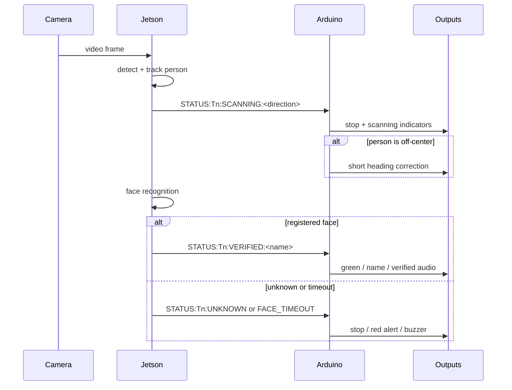

# PatrolPro Architecture

This document describes the current PatrolPro hardware/software split, runtime responsibilities, and safety-oriented control flow.

## Design Goal

PatrolPro separates **perception** from **physical control**:

- The **Jetson Nano** performs camera processing, person detection, tracking, face recognition, event capture, and dashboard serving.
- The **Arduino Mega** owns the patrol state machine, sensor interpretation, motor control, and physical status outputs.

This division prevents GPU-heavy vision processing from becoming the authority for real-time movement and hazard handling.

## High-Level Architecture

## Jetson Runtime

### `detect_people.py`

The main Jetson process coordinates:

- TensorRT-based person detection
- persistent track IDs using IoU matching
- face-verification scheduling
- Jetson ↔ Arduino serial messaging
- snapshot/event logging
- browser dashboard updates
- graceful shutdown around CUDA work

The current detector configuration uses a TensorRT engine with a 320×320 network input. Camera capture is configured for a 1280×720 stream at 30 FPS, while face identification is intentionally performed less frequently than person detection to reduce GPU load.

### Tracking

`PersonTracker` maintains persistent track IDs across frames and removes tracks after a configurable disappearance window. Verification state is tied to the track lifetime, so a person who leaves and re-enters must be verified again.

### Face Recognition

`face_id.py` performs the face identification stage. The main runtime only attempts verification after a person track is sufficiently stable, reducing false triggers from short-lived detections.

### Event Logging and Dashboard

`snapshot_writer.py` persists event data and snapshots. `web_dashboard.py` exposes a lightweight local HTTP interface using Python's standard-library HTTP server plus OpenCV, avoiding a Flask dependency on the Jetson environment.

## Arduino Runtime

The active firmware is located in `PatrolPro_Phase2/` and is split into modules rather than a single monolithic sketch.

| Module | Responsibility |
| --- | --- |
| `Config.h` | Pin mappings, thresholds, servo positions, motor tuning |
| `MotorControl.*` | Forward, reverse, turning, and stop primitives |
| `SensorSuite.*` | Sensor reads and hazard evaluation |
| `StatusOutputs.*` | LEDs, OLED, buzzer, camera servo |
| `SerialProtocol.*` | Serial command parsing and Jetson message handling |
| `PatrolController.*` | High-level state transitions and behavior |

## State and Priority Model

The system is structured so normal patrol can be interrupted by higher-priority events.

The exact controller contains more implementation detail, but the important design principle is that hazard and stop conditions can override normal patrol behavior.

## Obstacle Handling

The current firmware includes the following behaviors:

- reduce speed when a front obstacle is approximately 20–35 cm away
- stop at approximately 20 cm or less
- reverse briefly when rear space permits
- choose a turn direction based on side ultrasonic distance
- expose timed manual movement commands for subsystem testing

## Person Verification Flow

## Safety-Oriented Behaviors

- Boot defaults to a stopped/manual state rather than immediately moving.
- Autonomous motion requires an explicit `AUTO` command.
- Environmental hazard sensing is handled on the Arduino side.
- Vision and motor control are separated across devices.
- Unknown-person and hazard states produce explicit physical alerts.
- Serial testing commands allow subsystems to be exercised without entering the full autonomous loop.

## Prototype History

The repository keeps several earlier subsystem experiments for engineering traceability:

- `hazard_monitor/` — earlier integrated Arduino prototype
- `wall_bounce/` — motion-control / obstacle-response prototype
- `IR_test/` — IR sensor test
- `Servo_test/` — camera-servo test

These are not the active production firmware. The active Arduino implementation is `PatrolPro_Phase2/PatrolPro_Phase2.ino`.
